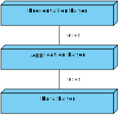
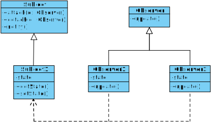
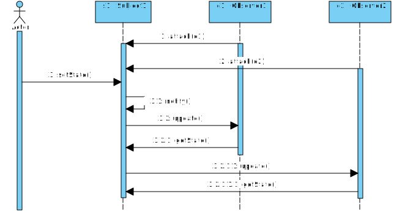
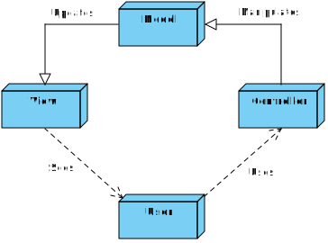
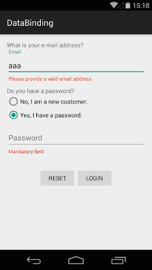
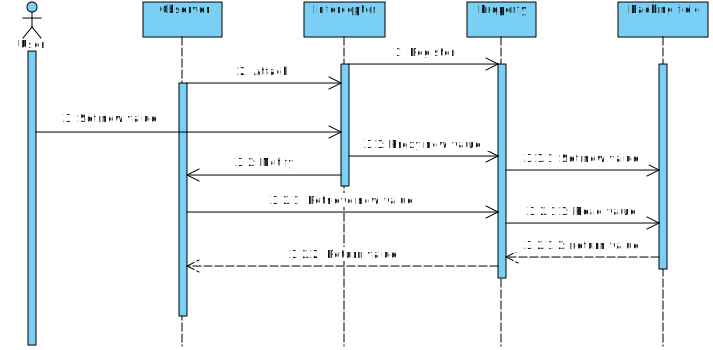
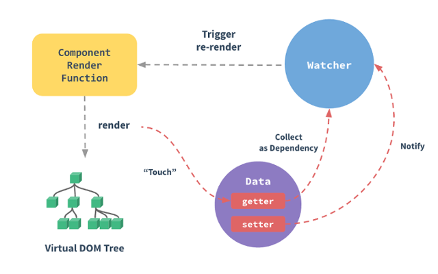

# Two-way data binding in MVC

## Data binding

### What is data binding?

First of all, we would like to define the term data binding and explain the principle behind it.
Most applications are separated in different application layers.
Almost always exists one GUI(Graphical User Interface) layer which has the responsibility for the display.
There is also a layer for the application logic and a data model layer.
This typical architecture is called 3-tier architecture.
In the following picture is an application split in the three typical tiers.
The presentation layer consists of various components which are displaying the GUI components and handle the user interaction.
The second tier is called application layer and is managing the business logic.
The application layer is responsible for the behavior of the application.
This includes the process flow logic, computations and control of the data.
The last layer is called data layer.
Its main point is to manage the persistence of the data, including loading and storing the data in a persistent way.



The main task for data binding is to bind an UI element (or its content) to an application model.
The value, which is displayed to the user is bound to a data container in the application logic.
Changes requested from a user are also triggered in the application logic to handle the new data.
This is a common software design pattern.
Most data binding frameworks implemented this mechanism with an Observer pattern, which is also a common and well-known software design pattern.
The Observer principle is working often as an underlying binding mechanism.

### Observer Pattern

This short paragraph represents a quick repetition of the Observer pattern.
If you are familiar with the principle, you may skip this section.

The following UML diagram models the typical class structure of the Observer pattern:



The Observer pattern is a software design pattern defining a one-to-many dependency between objects.
When one object changes his state, all its dependents are notified and updated automatically.
The next UML diagram shows how the update mechanism is implemented:



This technique is often used in other software design patterns like the MVC (Model-View-Controller) concept.
The observed object is called the subject and registers itself at an Observer when it is created.
Whenever the subject changes, it broadcasts to all registered Observers that it has changed.
Observers may pull only the information they needed from the subject, but in most cases, they are fully notified from the Observer.
This mechanism allows to split the view part of an application and the application logic.
An object in the business logic layer is registered as an Observer and all GUI components can register themselves by the Observer.
If one part is changing the state of the object in the application layer, all registered GUI components will be notified and can update their states in the UI.
This ensures a synchronous state application wide.
Because of these reasons many GUI frameworks and concepts have implemented the Observer pattern.

### MVC Pattern

The **M**odel **V**iew **C**ontroller (MVC) Pattern is a software architectural pattern for implementing user interfaces.
It divides the application into three interconnected parts.

* Model - the model is representing an object carrying data. It can also have logic to update controller if its data changes.
* View - the View represents the visualization of the data the model contains
* Controller -  the Controller acts on both model and view. It controls the data flow into model objects and updates the view whenever the data changes. It is the link between model and view and keeps the view and model separate.



The MVC pattern offers architectural advantages because it helps the developer to write a better organized, well separated application code.
This pattern is battle-proven and can be used for any programming language that includes a user interface.
The persistence of the data is not part of the pattern and could be solved with some different implementations.
For example, the controller can store the data in the model and persistence layer, or the model works with its own persistence strategy.

There are two well-known derivations of the MVC pattern: the **M**odel **V**iew **P**resenter (MVP) and the **M**odel **V**iew **V**iew**M**odel (MVVM) pattern.
These patterns are quite similar to the MVC pattern beside a few minor changes.
The most notable difference of the MVP to the MVC pattern is that the presenter is not only responsible for changing the model but also for updating the view when the model changes.

The MVVM pattern was developed by Microsoft when they created the Windows Presentation Foundation (WPF) framework.
In contrast to the MVC and MVP pattern MVVM introduces a so called _ViewModel_ which couples the view and model.
The biggest difference between the MVC and the MVVM pattern is that the MVVM pattern was already designed with data binding in mind.
The _ViewModel_ provides the view properties and commands to which view elements can be bound.
In the case of WPF the data binding is implemented in the declarative view code (called XAML in WPF).
Almost all current UI frameworks implement data binding in combination with MVVM or a derivation of it.
To name a few examples: AngularIO, Vue.js, Angular1 (they call it `controllerAs` style but actually it is MVVM) and many more.

JavaFX is one of the last frameworks where bindings are declared by writing _"real"_ code.
In JavaFX data binding is implemented with a set of special primitives (like `StringProperty`, `IntegerProperty` and so on) which can be bound to special properties of JavaFX view elements like this:

```java
/* import the view element to the controller */
@FXML
private TextField txtField;
/* declare a bindable property of type `String` */
private final StringProperty txtFieldProperty = new SimpleStringProperty();

@Override
public void initialize(URL url, ResourceBundle resourceBundle) {
   /* bind the TextField to the StringProperty in a bidirectional way */
    txtField.textProperty().bindBidirectional(txtFieldProperty);
    /* value will be set to TextField */
    txtFieldProperty.set("Hello Wold");
}
```

This mechanism offers a few advantages like _"conditional bindings"_ but it also requires the developer to declare all bindings in the code of the controller.
As long as the view does not contain more than five to ten elements that's no problem but with an increasing number of elements to handle the code is getting more complicated, unreadable and unmaintainable.

Almost all UI frameworks for web applications are declaring bindings within the HTML code with a special template syntax.
A popular example for data bindings in HTML with a template syntax is Vue.js which is covered later in this article.

### Challenges for data binding

Whenever a GUI application has to be implemented (or redesigned), programmers have to solve many challenges.
To name a few there are:

* Input Validation
* Data type mapping
* Performance issues

This chapter evaluates if these challenges can be solved with data binding.

#### Input Validation

Input validation is performed to ensure only properly formed data enters the workflow in an application.
This prevents incorrect data from being stored in the database and causing a malfunction of some components of the application.
Input validation is also a security aspect of an application.
Many attacks are successful because of weak (or missing) input validation in web applications.
A well-known example are SQL injection attacks, where the input of a user is not sanitized and is directly routed to an underlying SQL executor.
This allows the attacker to execute SQL commands in the context of the application.
Input validation should happen as early as possible in the data flow.
This includes also GUI input validation.
From an IT security perspective it's not enough to validate the data just in the GUI layer as this mechanism may be bypassed.

On the other hand, input validation is some extra feature and a benefit for the user.
For example, the field "city" can be auto filled if the zip code is entered correctly.
Another feature may be the validation of an e-mail address.
A warning could be displayed for the user if the e-mail address seems to be invalid.
The user can check and correct the input data and post the form successfully if all GUI validations are positive.

The following example shows an Android application where input validation is implemented.
A warning for an invalid mail address is displayed and there is a hint for the user that the password field is a mandatory field and input is required.



Depending on the platform and the framework used to implement the UI these validation rules may be declared within the markup like in Vue.js:

```html
<div class="form-group" :class="{'has-error': errors.has('email') }" >
    <label class="control-label" for="email">Email</label>
    <!--
      `v-validate` is a special attribute to mark that the value has to be validated
      by the rules declared within the `data-rules` attribute
     -->
    <input v-model="email"
    v-validate="email" data-rules="required|email" 
    type="email" placeholder="Email">
    <p class="text-danger" v-if="errors.has('email')">{{ errors.first('email') }}</p>
</div>
```

_Remark: the sample uses the library `vee-validate` for validation rules._

Or by adding validation decorators to the properties in the UI like in WPF:

```cs
public class Product {
  /* property will only be set if input value is present
   * and not longer than 50 characters
   * additionally an error will occur when the value is not set */
  [StringLength(50),Required]
  public string Name { get; set; }

  /* property will only be set if input value is between 0 and 9999 */
  [Range(0, 9999)]
  public int Weight { get; set; }
}
```

No matter which style of declaring the validation rules is used, a developer has to keep in mind, that validation also has its costs and adds more complexity to application e.g. in asynchronous scenarios.

#### Data type mapping

Another challenge, which has to be solved automatically with data binding is data type mapping.
It is a key aspect of a strongly typed programming language, that there are different data types like integer, string, object and so on..
The challenge for data binding is to automatically map different types of data to the same GUI element.
For example, a textbox field can represent integer values but also plain text.

On the other hand, a complex object has to be bound to a couple of fields in the GUI.
An example may be an object like "customer" with different type of information such as first name, last name and the birth date.
This mechanism is also part of the input validation topic because input validation must prevent storing wrong data types in the underlying objects.
Input validation can correct and remove incorrect data types such as characters from a purely numerical field.

#### Performance issues

Data binding is a great feature because it reduces the frontend code for the developer.
The programmer can set up a simple data binding with a few commands instead of writing a huge amount of frontend logic to display the values.

But there are also some disadvantages of data binding.
If there is a large amount of data to bind or if it is necessary to parse the data, a performance issue could occur.
The fact that every change is communicated can lead to costly operations.
Let's look at an example.
A complex object with a field for a mail address is bound to the GUI and each input has to be validated with a given whitelist of valid mail addresses.
Now a list of customers, in our case the complex object, is updating their mail addresses.
Each object must be validated against the whitelist and this could lead a performance issue in the GUI.

A good advice or good practice is to reduce heavy parsing of data in the GUI thread. The GUI should check for some basic input validations but a real validation should be triggered in the application logic layer.

### Two-way vs. One-way data binding

In most GUI frameworks are multiple binding mechanism supported. The developer can often choose between one-way and two-way binding. Some programming languages are supporting some additional binding mechanism like C# does with One-Way-To-Source and so on.
For each use case should a suited binding type chosen.

#### One-way data binding

First, we want to clarify the definition of one-way data binding. The following examples are used in a web application.

One-way data binding means that a scope variable in HTML will be set to the first value it\`s model is bound to - this is often the first assignment of the variable in the application layer. In other words, the data is bound to the view only once from the model.
A change in the GUI forced by the user, is ignored by the application layer because the data has not changed. This could lead to invalid states in the application.
This mechanism has a few advantages but also a few disadvantages. The following table provides a quick overview of the most important advantages and disadvantages.

| Pro                                           | Contra                                                                |
| --------------------------------------------- | --------------------------------------------------------------------- |
| only one direction of data flow               | No automatic adaption of data in the model, other components, the GUI |
| easy to debug                                 | invalid states in the application                                     |
| no code to display values in the GUI required | -                                                                     |

Listed as an advantage of one-way data binding is that it exists only one direction of the data flow, from the model to the view. This leads to a easier way to debug and search for errors for the developer in error cases. Also an advantage for the developer is the fact to write less code for the frontend. There is no logic for displaying the values in the GUI required. The code in the frontend looks cleaner and is easier to maintain. Another "advantage" is the fact that there is no input validation and data type mapping necessary. That\`s because the user cannot change the data - some applications could be useless. On the other hand, in some use cases you do not need to change the data from the view. For example, labels that displays help to the user do not need to be updated by the user.

#### Two-way data binding

A second implementation of data binding is two-way data binding. This means to bind a value from the model to the view, but also from the view to the model. Both directions are supported.
A scope variable in HTML will change its value every time the model is assigned to a different value. It exists a binding from model to view and from view to model.

The following table is showing the main advantages and disadvantages of two-way data binding.

| Pro                                                                                      | Contra                                                                |
| ---------------------------------------------------------------------------------------- | --------------------------------------------------------------------- |
| bind multiple GUI elements to single source  of truth in model                           | changes in model will cause a change in GUI &rarr; Performance issue  |
| data consistency guaranteed                                                              | input validation / data type matching                                 |
| changes in data will be automatically added  to GUI &rarr; write less code to display logic | data manipulation / parsing works not very well &rarr; performance issue |

A main advantage of two-way data binding is the fact that multiple GUI elements can be bound to a single source of truth in the application layer. This prevents invalid states of the application and data consistency could be guaranteed. A requested change of the data in the model will lead to a change in all registered GUI components, like in the chapter with the Observer pattern. All registered components can update their values if a state change is registered. And the way back from the view to the model is also possible. If the user is changing the data in the view and send a request to the backend of the application, this data can be changed in the model. And of course, the same advantage applies as with one-way-binding: less code is needed for the presentation in the frontend of the website, as well.
But there are also some disadvantages of two-way data binding. Major changes in the view can cause performance problems in the application. This aspect is already discussed in the beginning of this section using the example of whitelist customer mail addresses. Since both directions are supported, a change in the view also leads to a change in the application logic. This leads to the fact that input validations have to be carried out - see chapter "Input Validation" for more information.

### Frameworks supporting data binding

There are a lot of GUI frameworks that are supporting data binding. The following logo map will give an overview of the most popular frameworks.


There are not only web application frameworks, there are also some desktop GUI frameworks like JavaFx and Microsofts C# WPF. The binding mechanism is similar over all frameworks, only the syntax will be a bit different. Most frameworks are developed for JavaScript and the web environment such as Angular or React. In this Seminar Paper there will be a special view on Vue.js.

### TypeScript

Before we can start with the implementation of data binding a short introduction to TypeScript and its relevant technologies are necessary.

TypeScript is a statically typed language and will be compiled to plain JavaScript.
Since the release of Angular 2.0 at the latest, TypeScript has become well-known and popular.
Referring to the developer survey from 2017 by StackOverflow, TypeScript is the third most popular programming language among developers. ([Source](https://insights.stackoverflow.com/survey/2017))

TypeScript was developed because of some problems with JavaScript.
JavaScript has a reputation for being difficult to maintain in large projects and not easy to reuse.
The solution was to design a new programming language which solves the main problems of JavaScript.
The lead designer of TypeScript is Anders Heijlsberg, who is also the designer of C# at Microsoft.

TypeScript is strongly typed, object orientated and a compiled language.
It is also a superset of JavaScript because it will be compiled to plain JavaScript.
In other words: TypeScript is plain JavaScript with some additional features.
This is a major advantage as a developer doesn\`t need to learn a new programming language if he/she already knows how to program JavaScript.
Existing JavaScript code can be consumed in a TypeScript project, i.e. that existing JavaScript frameworks, tools and libraries can be reused in a TypeScript project.
Another advantage is the fact that TypeScript is portable across multiple browsers, devices and operating systems.
TypeScript runs wherever JavaScript runs.

Let's look at a first example of TypeScript:

```ts
class Greeting {
    greet(): void {
        console.log("Hello World!!!")
    }
}

let g = new Greeting();
g.greet();
```

Because TypeScript is strongly typed and object orientated a class called "Greeting" with a containing method "greet" can be created. A new object named 'g' is instantiated and the method 'greet()' will be called.

_Side note: since ECMAScript 2015 JavaScript also supports the definition of classes like in the TypeScript sample. Previously classes were typically defined by using the prototyping mechanism which looks a little beard for developers used to implement classes like in Java or C#._

If we are looking at a second example of TypeScript, a main advantage will appear:

```ts
let firstName: string = "John";
let score1: number = 50;
let score2: number = 42.50
let sum = score1 + score2
```

Compile Error:

```ts
let num: number = "hello"
```

⚡ Compiler error because `"hello"` is no `number`.
The compiler will throw an error, because the variable `"hello"` is no `number`. 
This is an advantage of a strongly typed programming language.

### Data binding implementation

There are different implementation possibilities for data binding.
It is much easier to understand how data binding is working under the hood when a concrete implementation is observed.

The following section discusses a simple (actually very naive) implementation of data binding in TypeScript.
Of course the example could be implemented in many other languages but TypeScripts strong typing makes it easier to understand as dynamic typed languages and it is very famous in web development which is one of the most important domains of data binding.

TypeScript implements a concept called "properties".
Java developers are used to implement private fields and corresponding `getter`s and `setter`s to make their fields accessible from outside the class scope.
Properties are aggregating these three parts to one: a _property_ of a class.

The following Java code:

```java
public class Person {
  private String firstName;

  public String getFirstName() { return this.firstName; }
  public void setFirstName(String firstName) { this.firstName = firstName; }
}
```

would look in TypeScript like this:

```ts
class Person {
  firstName: string
}
```

That does look like a public field but actually the TypeScript compiler generates a structure like this:

```ts
class Person {
  /* backing field */
  private _firstName: string

  /* getter */
  get firstName(): string {
    return this._firstName
  }

  /* setter */
  set firstName(firstName: string) {
    this._firstName = firstName
  }
}
```

Nearly the same structure like in the Java code but auto-generated!
By the way, in C# this kind of properties are called _auto properties_.
Each time the property `firstName` is set, the method `set firstName(...)` is executed and assigns the new value to the so called _backing field_.

_Side note: JavaScript also implements properties so this is not just true for TypeScript but for all code that is compiled to or pure JavaScript!_

This behavior can be used to implement data binding because it is possible to create an so called _interceptor_ which tracks all changes made to one or more (or even all) properties an object has.

*Side note: Interceptors are objects that don't change the logic but extend it with another aspect (because of that they are also called decorators and are a key concept of the aspect oriented programming (AOP) paradigm).*

The property of an object is the _subject_ in terms of the Observer pattern and there are _observers_ which are notified whenever the value of the property has been changed because actually the interceptor gets called when the value has to be changed, updates the underlying object and notifies all its _observers_ that a change occurred.

The following sequence diagram shows how an abstract observer is notified when the value of property is overwritten:



At first glance this sequence diagram may explain nothing but it does not contain more than the previous section already covered:

1. An _interceptor_ is registered at a _property_.
1. An _observer_ registers itself at the _interceptor_.
1. A _user_ triggers the _setter_ (e.g. by typing something into an input field).
1. The _setter_ is intercepted and the new value is proxied to the actual _setter_.
1. The actual _setter_ writes the value through to the _backing field_.
1. The _interceptor_ notifies the registered *observer*s.
1. The *observer*s retrieve the new value of the _backing field_ through the _getter_ of the _property_.

_Side note: obviously that explanation does not cover **all** aspects but the basics should be clear by now._

The remaining question is: how is this observer registered so that all `setter` calls are intercepted.
Actually that is pretty easy in JavaScript - other languages may require additional "magic".
To make a property "reactive" - as it is called in Vue.js - the JavaScript built-in method [`Object.defineProperty`](https://developer.mozilla.org/en-US/docs/Web/JavaScript/Reference/Global_Objects/Object/defineProperty) is used.
The method takes a few arguments: the object at which the property should be defined, the name of the property to define and a descriptor object which contains a few configuration keys and - far more interesting - a `get` and a `set` function object that are invoked whenever the value of the property should be read or written.
There are some edge cases which have to be handled (like what is if the field was already a property and what about arrays) but they are not required to get the concept.

The following snippet shows how to use `Object.defineProperty`:

```ts
Object.defineProperty(obj, key, {
  enumerable: true,
  configurable: true,
  get: function reactiveGetter() {
    /* proxy getter call
     * e.g. by calling the preserved getter */
  },
  set: function reactiveSetter(newVal) {
    /* intercept setter call
     * e.g. notify observers or write new value to console or anything else */
  }
});
```

There are still some things missing to complete a data binding mechanism e.g. a store for all observers, methods to update the UI and much more but these things are not covered here as they are not really import for the concept.

### Vue.js

Vue.js is a progressive JavaScript framework for building user interfaces.
Check out the [comparison](https://vuejs.org/v2/GUIde/comparison.html) with other common frameworks.
It is highly adoptable and easy to integrate in existing or new web projects.
Keep in mind that Vue.js doesn\`t support IE8 and below.

In the following example "data binding" will be used without Vue.js.
This is a sample implemented with Vanilla JS.
The first HTML snippet is a declaration of a paragraph with the id `"test-id"` and the default value `"Nothing to say"`.

```html
<p id="test-id">Nothing to say</p>
```

Now let us add some logic.
First the paragraph with the id `"test-id"` will be selected from the DOM (Document Object Model) and stored in a variable `"pElem"`.
After this step the value of the paragraph could be changed to `"Hello from JS"`.

```js
let pElem = document.getElementById("test-id");
pElem.innerHTML = "Hello from JS";
```

This snippet has not much in common with data binding, but it demonstrates the fundamental topic.
The following snippet implements the same logic but with "real data binding" accomplished with Vue.js:

```html
<div id="root">
  <input type="text" v-model='message'>
  <p>The value is {{message}}</p>
</div>

<script>
new Vue({
    el: '#root',
    data: {
        message: 'test binding'
    }
})
</script>
```

The value of `message` will be bound in both directions to the input field in the view.
The binding will be declared with a `"v-model"` or by using a `"{{template-string}}"` directly in HTML.
In the script tag a new Vue with a containing property message in the data property will be declared.
This information is bound to the view.

#### How data binding is implemented in Vue.js

The following picture describes how the mechanism of data binding in Vue.js is implemented.
The bound models are just plain JavaScript objects.
When the developer modifies these objects, the view will update.
The mechanism is called Vue\`s reactivity system.



If a plain JavaScript object is bound to a Vue instance, Vue will traverse all of its properties and convert them to getters/setters using `Object.defineProperty`.
These getters/setters are invisible to the user but allow Vue to perform dependency tracking and change notification when properties are accessed or modified.
Each component instance has a corresponding `Watcher` instance which records any changes of the instance.
These changes can be rendered into the virtual DOM tree.

Be careful, Vue is limited to the features of JavaScript and cannot detect property additions or deletions!

```js
var vm = new Vue({
  data: {
    a: 1  // `vm.a` is now reactive
  }
})
vm.b = 2 // `vm.b` is NOT reactive
```

The addition of the variable `"b"` will not be notified.
This problem, if needed, could be solved with:

```js
Vue.set(vm.someObject, 'b', 2)
```

As already discussed, a typical design flaw of data binding are performance issues if a huge amount of data is bound and has to be updated at the same time.
Vue.js solves this problem by performing DOM updates _asynchronously_.
Whenever a data change is observed, it will open a queue and buffer all the data changes that happen in the same event loop.
If the same watcher is triggered multiple times in the same event loop, it will be pushed only once to the queue.
This mechanism is preventing unnecessary calculations and DOM manipulations.
An intern event called _tick_ is triggered and the queues will be flushed and the update will be executed.
This means that changed components in the GUI will not re-render immediately.
It will update in the next _tick_ event, when the queue is flushed.
Most of the time the developer should not care about this, but in some cases it could be necessary to manipulate the DOM by hand.
Otherwise some actions should be triggered if the component is re-rendered.
For this kind of use case Vue.js is providing a callback function to be notified if the _tick_ event is executed.

```js
Vue.component('example', {
  template: '<span>{{ message }}</span>',
  data: function () {
    return {
      message: 'not updated'
    }
  },
  methods: {
    updateMessage: function () {
      this.message = 'updated'
      console.log(this.$el.textContent) // => 'not updated'
      this.$nextTick(function () {
        console.log(this.$el.textContent) // => 'updated'
      })
    }
  }
})
```

A new Vue component is declared with a bounded property `message` and containing methods.
The instance method `vm.$nextTick()` will be automatically bound to the current Vue instance.

## Summary

### Data binding

Data binding is an elementary concept of GUI programming often based on common software design patterns like the Observer pattern.
There are some disadvantages of data binding which could be possible a problem but the advantages outweigh the disadvantages.
The developer should choose the right binding mechanism for the suited use case to prevent errors.
There are a lot of GUI frameworks who are support data binding.

### Typescript

Typescript is a superset of JavaScript, which means that an average JavaScript programmer could easily learn Typescript.
He/she will take benefits with Typescript like a strongly typed language, object orientation and compile checks.
Some kind of errors could be detected while compile time and will not throw runtime errors.

### Vue.js

Vue.js is a lightweight JavaScript framework to easily create and maintain applications.
The integrated data binding is asynchronously implemented with buffer and queues.
This overrides the main disadvantage of speed problems.
