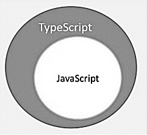

@title[Einleitung]

# Two-way data binding

Peter Kurfer, Thomas Mildner

---

## Agenda

* What is data binding?
* History and concepts
* Two-way vs. One-way databinding
* Frameworks supporting databinding

+++

## Agenda

* Introduction to TypeScript
* Introduction Vue.js
* Databinding in Vue.js
* Problems of databinding
* Exercise

---
## What is data binding?

&rarr; Software Design Pattern  
&rarr; Observer Pattern works as underlying binding mechanism  
&rarr; bind UI element to an application model

+++
## Observer Pattern

+++ 

## Challenges for data binding

&rarr; input validation   
&rarr; data type mapping

  

---

## History and concepts

---

## Two-way vs. One-way databinding

---

## Frameworks supporting databinding

---

## Typescript

&rarr; statically typed language   
&rarr; compiles to plain javascript   
&rarr; popular js framework <b>Angular 2.0</b>   

+++

## Problems of Javascript

&rarr; JS first developed as a language for client-side  
&rarr; Node.js marked JS as an emerging server-side technology    
&rarr; JS difficult to maintain and not reusable  
&rarr; no Object Orientation, no strong type checks, no compiling checks   

+++

## Solution = Typescript

&rarr; designed by Andrers Hejlsberg (Designer of C# at Microsoft)   
&rarr; strongly typed, object orientated and compiled language   
&rarr; Typescript is a superset of Javascript   
&rarr; will be compiled to Javascript   

+++
Typescript is Javascript plus some additional features  

--- 

## Vue.js

---

## Databinding in vue.js

---

## Problems of databinding

--- 

## Exercise