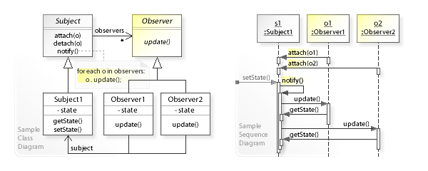

@title[Einleitung]

# Two-way data binding

Peter Kurfer, Thomas Mildner

---

## Agenda

* What is data binding?
* History and concepts
* Two-way vs. One-way databinding
* Frameworks supporting databinding

+++

## Agenda

* Introduction to TypeScript
* Introduction Vue.js
* Databinding in Vue.js
* Problems of databinding
* Exercise

---
## What is data binding?

&rarr; Software Design Pattern  
&rarr; Observer Pattern works as underlying binding mechanism  
&rarr; bind UI element to an application model

+++
## Observer Pattern

+++ 

## Challenges for data binding

&rarr; input validation   
&rarr; data type mapping

  

---

## History and concepts

---

## Two-way vs. One-way databinding

---

## Frameworks supporting databinding

---

## Typescript

--- 

## Vue.js

---

## Databinding in vue.js

---

## Problems of databinding

--- 

## Exercise